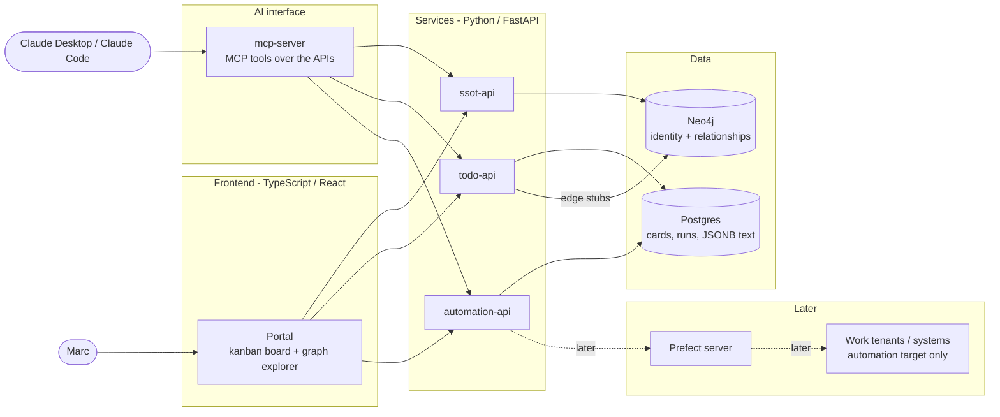
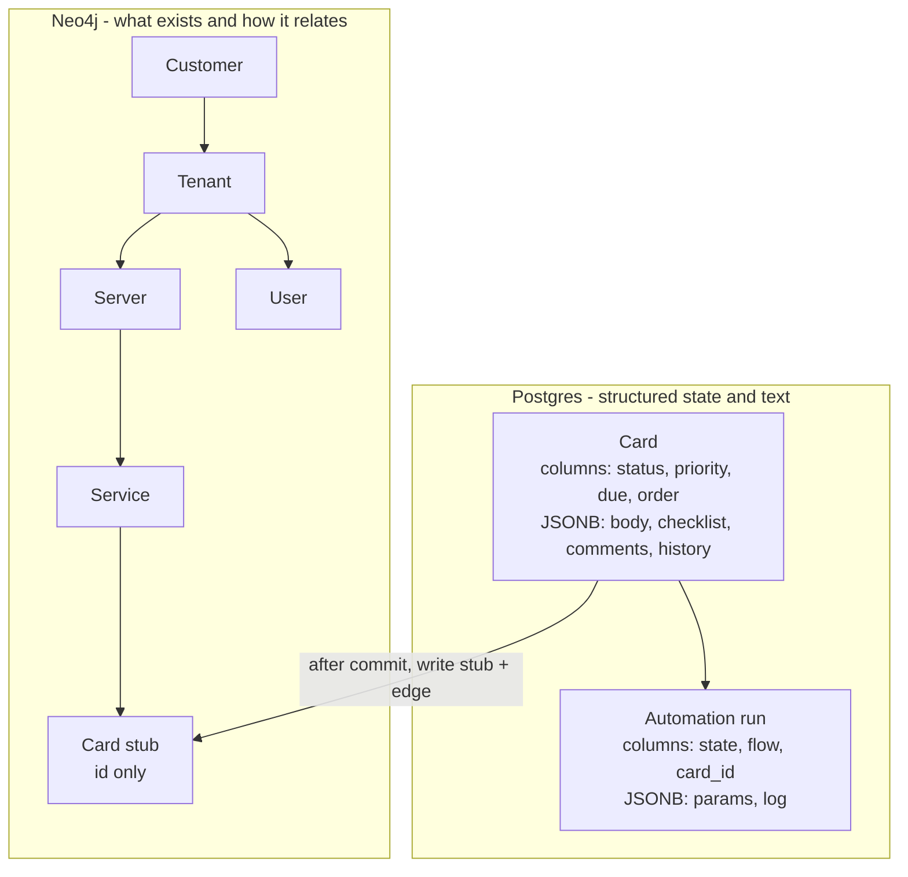
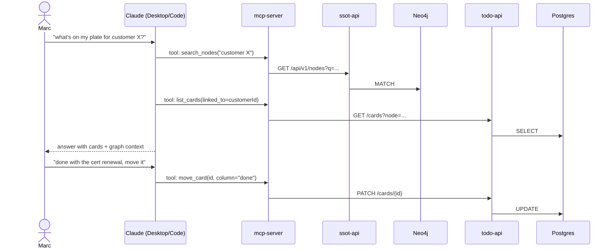

# yani architecture

Living document. Grows as decisions are made.

Yani is a personal automation and todo kanban worker for one user (Marc). Self-hosted, local,
single user. Two ideas carry the whole system:

1. **Graph SSOT** (Neo4j): work knowledge — customers, tenants, servers, services, how they
   relate — lives as a queryable graph instead of markdown notes. AI queries it via MCP.
2. **Todo kanban** (Postgres): tasks as cards on a board, linked to the graph entities they
   are about. Automations create and move cards.

No authentication. The app never leaves the local machine / private network. Claude Desktop
and Claude Code are first-class clients through an MCP server — no Anthropic API key needed
for that path, model usage rides the existing Claude subscription.

## 1. System overview

Every box is a container in one `docker compose` stack.

Dropped from the MSP design: Zitadel (no auth at all), the customer portal, and Traefik as a
required edge (plain localhost ports in dev; a reverse proxy can return later if the stack
ever serves more than one machine).

## 2. AI interface

The MCP server is the only AI-specific component. It is a thin adapter: MCP tools in,
existing REST APIs out. No model calls inside, no intelligence, no state.

- Transport: streamable HTTP on a local port (works for both Claude Desktop and Claude Code),
  registered once per client (`claude mcp add` / Claude Desktop config).
- Tools mirror the APIs: query/search the graph, inspect an entity and its neighbourhood,
  list boards and cards, create/move/comment cards, trigger and inspect automation runs.
- Because Claude is the client, this path needs **no API key** — the subscription pays.
- Only if yani itself ever calls Claude (e.g. a Prefect flow summarising something with
  nobody at the keyboard) does it need its own credential. Keep any such call behind an
  adapter, decision deferred.

## 3. Data ownership

Rule: every entity has exactly one home store. Other stores hold only its ID.

Neo4j nodes carry: stable ID (ULID), name, type, minimal props needed for graph queries.
No bodies, no logs, no payloads. The label/edge catalog in `ssot-api` gets repurposed from
MSP entities to whatever the work landscape actually contains — that catalog is the single
place the graph model is defined.

Kanban model: one board to start. Columns are data (Postgres rows with an order), not an
enum, so the board is rearrangeable without migrations. A card's `status` is its column ID.

## 4. Request flow: Claude works the board

The portal shows the same board and graph — Claude and the UI are two clients of the same
APIs, nothing AI-flavoured leaks into the services.

## Open

- Graph catalog for the work landscape (which labels/edges replace the MSP set).
- Kanban columns to seed with (working default: backlog, todo, doing, waiting, done).
- automation-api: separate service or router inside todo-api.
- mcp-server: own container vs mounted inside one of the FastAPI apps.
- Whether unattended automations ever call Claude, and with which credential.
- Attachments store (MinIO) and mail (Mailpit) not drawn yet.
