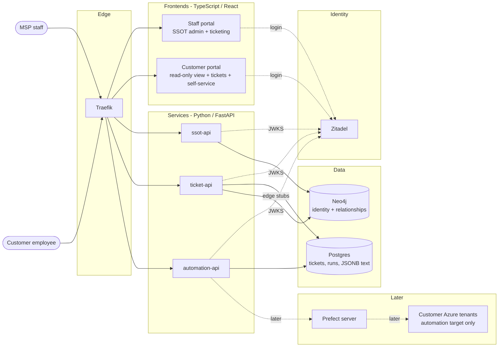
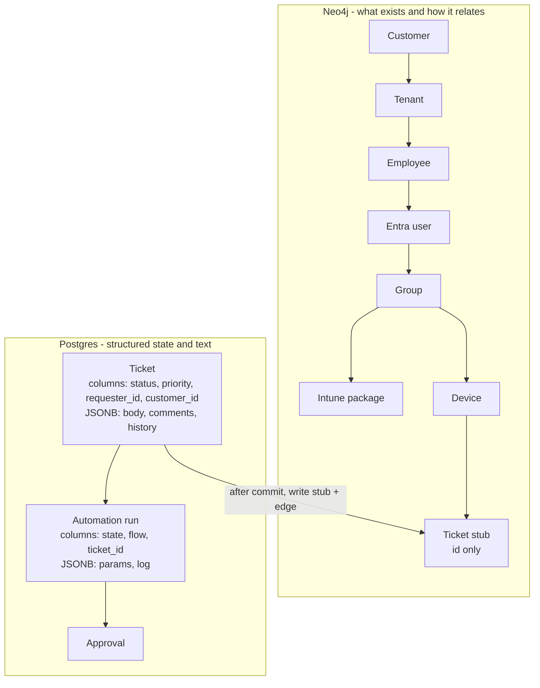
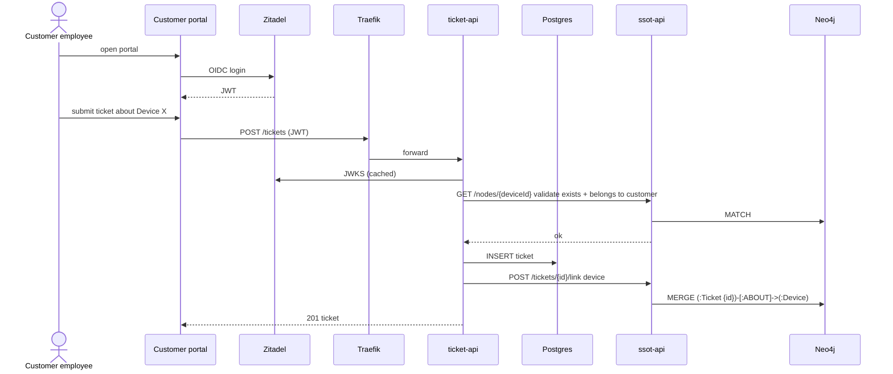

# yani architecture

Living document. Grows as decisions are made. Nothing here is implemented yet.

## 1. System overview

Who talks to what. Every box is a container in one `docker compose` stack.
Login is Zitadel's hosted page, branded to the portal theme. Portals only redirect to it and never render credential forms.

## 2. Data ownership

Rule: every entity has exactly one home store. Other stores hold only its ID.

Neo4j nodes carry: stable ID (ULID), name, type, minimal props needed for graph queries (e.g. Site lat/lon).
No bodies, no logs, no payloads.

## 3. Request flow: customer opens a ticket

## Open

- Component folder names and monorepo layout.
- Automation-api separate service or router inside ticket-api.
- Attachments store (MinIO) and mail (Mailpit) not drawn yet.